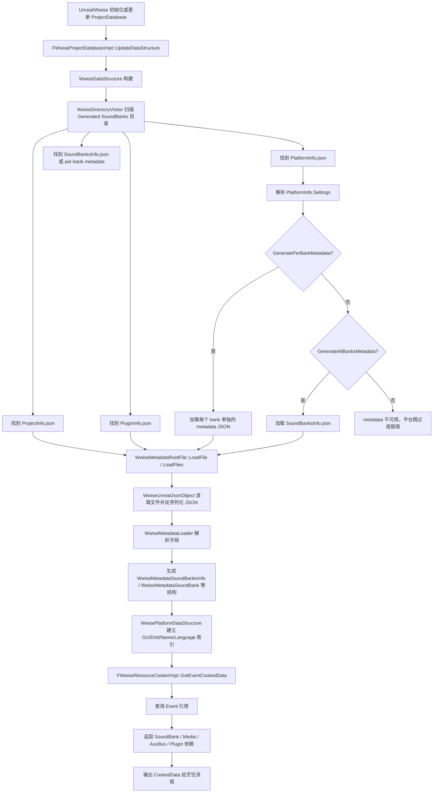

## 结论概览

Unreal 的 Wwise 集成在烹饪或准备资源时，并不是临时去直接读取某个 Event 对应的 JSON 文件，而是先由 `WwiseProjectDatabase` 模块统一扫描、读取并解析 Wwise 生成目录下的元数据 JSON，构建一份内存数据库。后续 `WwiseResourceCooker`、`WwiseResourceLoader` 等模块只是查询这份数据库。

因此，从职责上可以分成两层：

- `WwiseProjectDatabase`：负责扫描目录、读取 JSON、解析成结构体、建立索引。
- `WwiseResourceCooker`：负责根据 Event、SoundBank、Media 等对象信息，从数据库中查出烹饪所需数据。

## 核心模块职责

### 1. 资源查询层

关键文件：

- `WwiseResourceCooker/Private/Wwise/WwiseResourceCookerImpl.cpp`

关键方法：

- `FWwiseResourceCookerImpl::GetEventCookedData`
- `FWwiseResourceCookerImpl::GetSoundBankCookedData`
- `FWwiseResourceCookerImpl::GetProjectDatabase`

这一层的特点是：

- 不直接打开 JSON 文件。
- 它通过 `GetProjectDatabase()` 拿到项目数据库。
- 然后从当前平台的数据结构里查询某个 Event、SoundBank、Media 的引用关系。
- 查询结果已经是内存中的索引和对象引用，不再做原始 JSON 解析。

### 2. 数据库构建层

关键文件：

- `WwiseProjectDatabase/Private/Wwise/WwiseProjectDatabaseImpl.cpp`
- `WwiseProjectDatabase/Private/Wwise/WwiseDataStructure.cpp`
- `WwiseProjectDatabase/Private/Wwise/WwiseDirectoryVisitor.cpp`

关键方法：

- `FWwiseProjectDatabaseImpl::UpdateDataStructure`
- `WwiseDataStructure::WwiseDataStructure`
- `WwiseDataStructure::LoadDataStructure`
- `WwiseDirectoryVisitor::IterateDirectory`

这一层负责：

- 确定 Generated SoundBanks 的目录。
- 扫描其中的 `ProjectInfo.json`、`PlatformInfo.json`、`PluginInfo.json`、`SoundBanksInfo.json` 以及 per-bank metadata 文件。
- 根据平台设置决定加载总表还是单独 bank JSON。
- 读取并解析这些文件。
- 建立按 GUID、ShortId、Name、Language 分类的索引表。

## JSON 真正在哪里读取

关键文件：

- `WwiseProjectDatabase/Public/Wwise/AdapterTypes/Unreal/WwiseUnrealJsonObject.h`
- `WwiseProjectDatabase/Private/Wwise/Metadata/WwiseMetadataRootFile.cpp`
- `WwiseProjectDatabase/Private/Wwise/Metadata/WwiseMetadataLoader.cpp`

关键方法：

- `WwiseUnrealJsonObject::WwiseUnrealJsonObject(const WwiseUnrealString& FilePath)`
- `WwiseMetadataRootFile::LoadFile`
- `WwiseMetadataRootFile::LoadFiles`
- `WwiseMetadataLoader` 的 `GetBool`、`GetString`、`GetArray`、`GetObjectPtr` 等系列方法

读取过程可以概括为：

1. `WwiseUnrealJsonObject` 用 Unreal 的文件与 JSON 接口，把文件内容读成字符串并反序列化为 JSON 对象。
2. `WwiseMetadataRootFile::LoadFile` 基于这个 JSON 根对象创建 metadata 根结构。
3. `WwiseMetadataLoader` 从 JSON 字段中提取具体数据，填充到各种 `WwiseMetadata*` 结构里。

## 读取哪些 JSON 文件

目录扫描阶段由 `WwiseDirectoryVisitor` 负责识别文件类型。

主要文件分为四类：

- `ProjectInfo.json`
  - 描述项目级的平台、语言等基础信息。
- `PlatformInfo.json`
  - 描述平台配置、生成设置、RootPaths 等。
- `PluginInfo.json`
  - 描述插件库信息。
- SoundBank metadata
  - 可能是单个总表 `SoundBanksInfo.json`
  - 也可能是每个 bank 一个独立 metadata JSON

## 读取总表还是单独 bank JSON：依据什么决定

这是整个流程里最关键的分支逻辑。

判定依据不是 Unreal 自己额外配置的开关，而是 Wwise 生成出来的 `PlatformInfo.json` 中 `Settings` 字段里的两个布尔值：

- `GeneratePerBankMetadata`
- `GenerateAllBanksMetadata`

相关文件：

- `WwiseProjectDatabase/Private/Wwise/Metadata/WwiseMetadataPlatformInfo.cpp`
- `WwiseProjectDatabase/Private/Wwise/Metadata/WwiseMetadataSettings.cpp`
- `WwiseProjectDatabase/Public/Wwise/Metadata/WwiseMetadataSettings.h`

### 分支逻辑

#### 情况 1：`GeneratePerBankMetadata = true`

行为：

- 优先读取每个 bank 单独的 metadata JSON。
- 平台目录下收集到的 metadata 文件会被逐个加入加载列表。

特点：

- 更细粒度。
- 适合按需加载与构建更精确的索引。
- 当前集成逻辑中，它的优先级最高。

#### 情况 2：`GeneratePerBankMetadata = false` 且 `GenerateAllBanksMetadata = true`

行为：

- 读取总表 `SoundBanksInfo.json`。

特点：

- 所有 bank 信息集中在一个文件里。
- 逻辑更简单，但通常不如 per-bank 精细。

#### 情况 3：两个都为 `true`

行为：

- 仍然优先读取 per-bank metadata。

也就是说，虽然 Wwise 同时生成了两类文件，但 Unreal 集成会选择单独 bank JSON 路线。

#### 情况 4：两个都为 `false`

行为：

- 认为当前平台没有生成可用的 metadata，数据库构建失败或跳过该平台。

## SoundBank 信息如何进入内存数据库

关键文件：

- `WwiseProjectDatabase/Private/Wwise/Metadata/WwiseMetadataSoundBanksInfo.cpp`
- `WwiseProjectDatabase/Private/Wwise/Metadata/WwiseMetadataSoundBank.cpp`
- `WwiseProjectDatabase/Private/Wwise/WwiseDataStructure.cpp`

关键结构：

- `WwiseMetadataSoundBanksInfo`
- `WwiseMetadataSoundBank`

解析后的典型字段包括：

- SoundBank 自身：`Id`、`GUID`、`Language`、`ShortName`、`Path`、`ObjectPath`
- 关联媒体：`Media`
- 关联事件：`Events`
- 关联总线：`Busses`、`AuxBusses`
- 插件相关：`Plugins`
- 其他对象：`DialogueEvents`、`Triggers`、`ExternalSources` 等

然后 `WwisePlatformDataStructure` 会遍历这些结构，把它们建成多套索引，例如：

- 按 GUID 索引
- 按 ShortId 索引
- 按 Name/ObjectPath 索引
- 按语言索引
- 按 SoundBank 与 Media 的归属关系索引

这样后续查询 Event、Bank、Media 时就不再依赖文件 IO。

## `GetEventCookedData` 在整体中的位置

`FWwiseResourceCookerImpl::GetEventCookedData` 的职责不是“读 JSON”，而是“查数据库并组装烹饪数据”。

它的大致工作流程是：

1. 通过 `GetProjectDatabase()` 拿到数据库实例。
2. 锁住数据库数据结构，获取当前平台数据。
3. 取得当前平台支持的语言集合。
4. 调用平台数据结构的查询方法，找到目标 Event 在各语言下的引用。
5. 从这些引用继续追到所属 SoundBank、Media、AuxBus、Plugin 等依赖对象。
6. 汇总成 `FWwiseLocalizedEventCookedData` 返回给烹饪流程。

因此它是数据库消费者，不是 JSON 读取者。

## 总体分层理解

可以把整个机制理解成下面三层：

### 第一层：文件扫描

- `WwiseDirectoryVisitor`
- 找出有哪些 metadata 文件可用

### 第二层：JSON 解析与建库

- `WwiseUnrealJsonObject`
- `WwiseMetadataRootFile`
- `WwiseMetadataLoader`
- `WwiseDataStructure`

### 第三层：业务查询与烹饪

- `FWwiseProjectDatabaseImpl`
- `FWwiseResourceCookerImpl`
- 根据 Event / Bank / Media 查询烹饪所需数据

## 流程图

## 最终总结

- Unreal Wwise 集成的 Bank 信息读取，本质上是“先建库，再查询”。
- 真正的 JSON 读取发生在 `WwiseProjectDatabase`，不是 `WwiseResourceCookerImpl::GetEventCookedData`。
- 读取总的 `SoundBanksInfo.json`，还是读取每个 bank 单独的 metadata JSON，取决于 `PlatformInfo.json` 中的 `Settings`。
- 判定优先级是：
  - 优先 per-bank metadata
  - 否则退回 `SoundBanksInfo.json`
  - 两者都没有则当前平台 metadata 不可用
- `GetEventCookedData` 只是利用已经建好的数据库，把 Event 所需的 Bank、Media 和其他依赖关系整理成烹饪结果。
