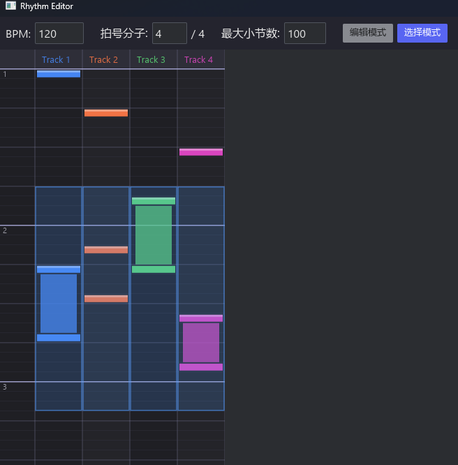

> 源码地址：[https://github.com/xmimu/rhythm-editor](https://github.com/xmimu/rhythm-editor)



## 1. 项目概述

**Rhythm Editor** 是一个基于 Rust + [iced](https://github.com/iced-rs/iced) 0.14 框架的节奏游戏谱面编辑器桌面应用。用户可以在网格化的时间轴上放置、编辑和管理多轨道音符，用于制作节奏游戏的谱面。

---

## 2. 技术选型

| 层面       | 选择                        | 理由                                   |
| ---------- | --------------------------- | -------------------------------------- |
| 语言       | Rust (Edition 2024)         | 类型安全、高性能、无 GC                |
| GUI 框架   | iced 0.14 (canvas feature)  | 纯 Rust 跨平台 GUI，原生 Canvas 绘制  |
| 渲染方式   | `iced::widget::canvas`      | 适合自定义网格绘制，支持缓存与交互事件 |

---

## 3. 架构设计

采用 iced 推崇的 **Elm 架构**（The Elm Architecture, TEA）：

```
┌────────────┐    Message     ┌────────┐    视图树    ┌────────┐
│   View     │ ──────────────>│ Update │ ──────────> │  View  │
│  (渲染UI)  │                │ (状态) │             │ (渲染) │
└────────────┘                └────────┘             └────────┘
      ▲                            │
      └────────────────────────────┘
              新的 State
```

- **State**（`BeatmapEditor`）：持有所有应用状态，包括 BPM、拍号、音符数据、编辑模式、选区、剪贴板等。
- **Message**（`Message` 枚举）：描述所有可能的用户动作。
- **Update**（`update` 函数）：纯函数式地根据消息更新状态。
- **View**（`view` 函数）：根据当前状态生成 UI 元素树。

---

## 4. 数据模型

### 4.1 音符（Note）

```rust
pub struct Note {
    pub track: usize,       // 所在轨道 (0..TRACK_COUNT)
    pub start_unit: u32,    // 起始时间单位
    pub kind: NoteKind,     // 类型：Tap 或 Hold
}

pub enum NoteKind {
    Tap,                        // 单击音符
    Hold { end_unit: u32 },     // 长按音符，有结束时间
}
```

- 时间轴离散化为 **unit**，每小节固定 16 个 subdivision。
- 总 unit 数 = `max_measures × SUBDIVISIONS`。

### 4.2 轨道

- 固定 4 条轨道（`TRACK_COUNT = 4`），每条轨道有独立配色。
- 通过常量数组 `TRACK_COLORS` 定义蓝、橙、绿、紫四色。

### 4.3 选区与剪贴板

```rust
pub struct Selection {
    pub start_track / end_track: usize,
    pub start_unit / end_unit: u32,
}

pub struct ClipboardData {
    pub notes: Vec<Note>,       // 拷贝的音符快照
    pub base_track: usize,      // 选区左上角轨道，用于粘贴偏移计算
    pub base_unit: u32,
}
```

选区支持 `normalized()` 方法，自动将起止点排序为左上→右下。

---

## 5. 编辑模式

系统设计了两种互斥的操作模式：

| 模式          | 交互方式                                         |
| ------------- | ------------------------------------------------ |
| **Edit 模式** | 左键点击 = 添加 Tap 音符；拖拽 = 创建 Hold 长条音符；右键 = 删除 |
| **Select 模式** | 拖拽 = 框选区域；Ctrl+C/X/V = 复制/剪切/粘贴；Delete = 删除选区 |

模式切换时自动清除选区状态。

---

## 6. Canvas 渲染层设计

### 6.1 双层渲染

采用 **背景层 + 前景层** 的分离绘制策略：

1. **背景层**（`draw_background`）—— 由 `Cache` 缓存，仅在 `grid_version` 变化时重绘：
   - 深色底色
   - 轨道标题（Track 1–4）
   - 奇偶轨道交替底色
   - 纵向分隔线
   - 横向时间线（小节线 > 拍线 > 细分线，粗细/颜色递减）
   - 左侧小节编号

2. **前景层**（每帧重绘）：
   - 所有音符的渲染（`draw_notes`）
   - 悬停单元格高亮
   - 拖拽预览（编辑模式下的 Hold 预览）
   - 选区高亮与边框（选择模式）

### 6.2 缓存策略

通过 `grid_version: u64` 版本号控制缓存失效。任何改变网格结构的操作（小节数变更、音符增删、模式切换等）都会递增版本号，触发背景层重绘。

### 6.3 音符绘制细节

- **Tap 音符**：实心矩形 + 顶部高光条，营造按钮质感。
- **Hold 音符**：三段式绘制——头部（同 Tap 样式）、中段（半透明窄条）、尾部（实心矩形），视觉上形成"连接"效果。

---

## 7. 交互设计（Canvas Program）

`GridCanvas` 实现 `canvas::Program<Message>` trait，交互状态存储在 `GridInteraction` 中：

| 状态字段           | 用途                                  |
| ------------------- | ------------------------------------- |
| `drag_start`        | 编辑模式下记录拖拽起点               |
| `hover_cell`        | 当前悬停的单元格坐标                 |
| `selecting_start`   | 选择模式下框选起点                   |
| `live_selection`    | 拖拽中的实时选区（尚未提交）         |
| `grid_cache`        | 背景层缓存                           |
| `cached_version`    | 缓存对应的版本号                     |

### 坐标映射

`cell_at(pos) -> Option<(usize, u32)>` 将像素坐标转换为 `(轨道索引, 时间单位)`，扣除标签区和表头偏移后计算。

---

## 8. 消息流

```
用户操作 → Canvas Event → Message → update() → State 更新 → view() 重渲染
```

核心消息类型：

- **参数调整**：`BpmChanged`、`BeatsChanged`、`MaxMeasuresChanged`
- **模式切换**：`SetMode(EditorMode)`
- **编辑操作**：`GridAddNote`、`GridDeleteNote`、`GridDragEnd`
- **选区操作**：`SelectionUpdated`、`CopySelection`、`CutSelection`、`DeleteSelection`、`PasteAt`

---

## 9. UI 布局

```
┌─────────────────────────────────────────────────────┐
│  控制栏: BPM | 拍号 | 最大小节数 | 模式按钮 | 状态  │
├─────────────────────────────────────────────────────┤
│                                                     │
│  可滚动的 Canvas 网格                                │
│  ┌──────┬─────────┬─────────┬─────────┬─────────┐   │
│  │ 小节 │ Track 1 │ Track 2 │ Track 3 │ Track 4 │   │
│  │  号  │  (蓝)   │  (橙)   │  (绿)   │  (紫)   │   │
│  ├──────┼─────────┼─────────┼─────────┼─────────┤   │
│  │  1   │         │  ■      │         │         │   │
│  │      │  ║      │         │  ■      │         │   │
│  │      │  ║      │         │         │  ■      │   │
│  │  2   │         │         │         │         │   │
│  │  ... │  ...    │  ...    │  ...    │  ...    │   │
│  └──────┴─────────┴─────────┴─────────┴─────────┘   │
│                                                     │
└─────────────────────────────────────────────────────┘
```

- 顶部控制栏使用 `row!` 宏横向排列，深色背景。
- 网格区域通过 `scrollable` 包裹，支持纵向滚动浏览大量小节。
- Canvas 尺寸根据 `max_measures` 动态计算。

---

## 10. 关键常量

| 常量           | 值    | 说明                       |
| -------------- | ----- | -------------------------- |
| `TRACK_COUNT`  | 4     | 轨道数                     |
| `CELL_W`       | 68.0  | 单元格宽度 (px)            |
| `CELL_H`       | 14.0  | 单元格高度 (px)            |
| `LABEL_W`      | 50.0  | 左侧标签列宽度 (px)       |
| `HEADER_H`     | 28.0  | 顶部标题行高度 (px)       |
| `SUBDIVISIONS` | 16    | 每小节的细分数             |

---

## 11. 后续扩展方向

- **音频播放**：集成音频引擎，实现 BPM 同步的播放/预览。
- **谱面序列化**：导入/导出谱面文件（JSON / 自定义格式）。
- **撤销/重做**：基于命令模式实现操作历史栈。
- **细分度调节**：支持 1/8、1/12、1/16、1/32 等不同细分粒度。
- **音符类型扩展**：滑键、Flick 等更多音符种类。
- **多轨道支持**：动态增减轨道数量。
